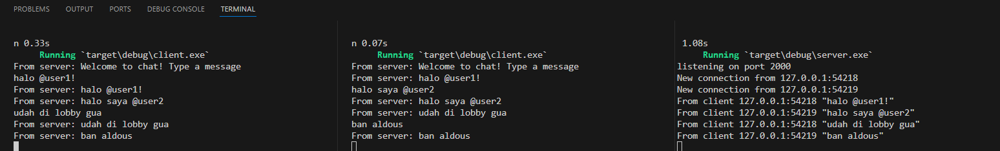
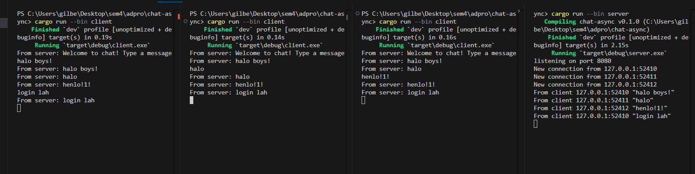
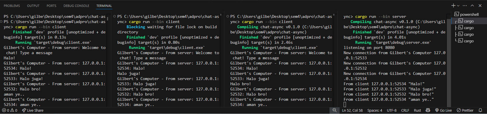

# Gilbert Kristian - 2306274951 - Adpro A

## 2.1 Original Code of Broadcast Chat

In my setup, the server is running on the right, while the clients are shown on the left and middle terminals. To run the server or any client, I use the command `cargo run --bin (server/client)`. In this case, I ran `cargo run --bin server` in the right terminal (server), and `cargo run --bin client` in the left and middle terminals (clients). Once I launch the client, the server detects a new connection from the client and recognizes the other client connections as well. When I type a message in one of the clients, it gets sent to the server, which then broadcasts the message to all the connected clients. As a result, all clients receive the message, even though I only typed it in one client.

## Modifying the Websocket Port

Once the port was modified, the chat broadcast continued to function properly. The main difference here is that I set the server to listen on port 8080. To ensure that the broadcast still functions correctly, both the client and server WebSocket connections must operate on the same port. If the ports don't match, the two sides won't be able to communicate or establish a connection. In this case, since I already separated `client.rs` and `server.rs` files, it’s essential to update the port settings for the WebSocket connections defined in both files. Both WebSockets operate under the TCP protocol, which allows them to communicate smoothly as long as they are configured to use the same port.

## Small changes, add IP and Port

## Modifications for Personalization

For the server, I started by editing the "New connection from..." message and included my name in the output. I made this change because that section of the code is where the string is specifically printed. Next, I modified the `handle_connection` function, particularly the part where the message is sent through `bcast_tx`. I updated the string being sent to include a formatted string that also includes the sender's address. As a result, the message received by the client now includes the sender's IP address. On the client side, I made a simple adjustment by modifying the "From server: ..." string to include my name.
